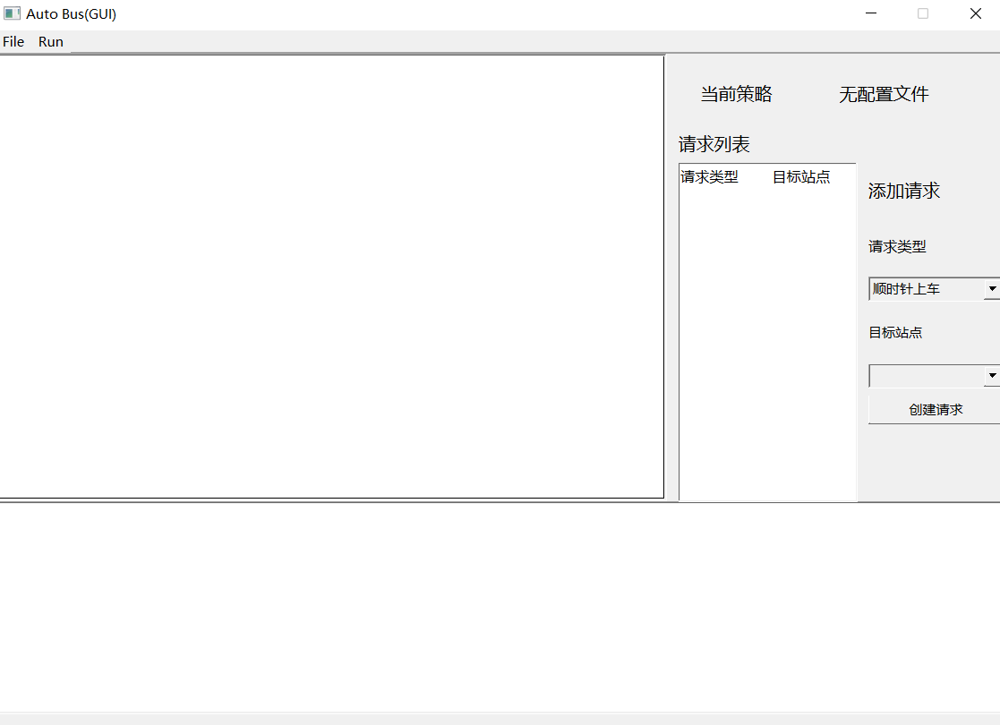
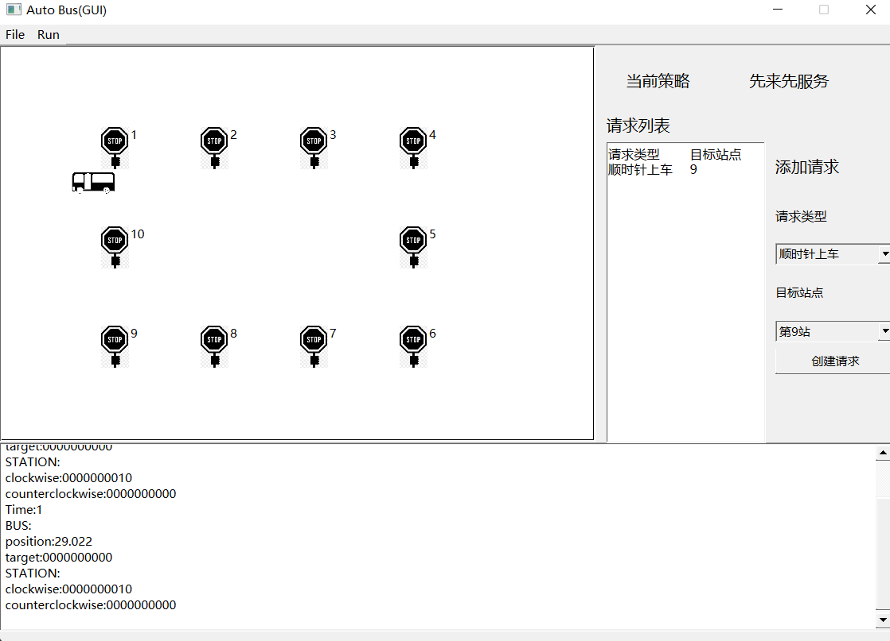

# Auto Bus GUI

[](https://github.com/jackfiled/auto_bus/actions/workflows/build.yml)

北京邮电大学计算机学院2021级《计算导论与程序设计》实践大作业“公交车调度”的GUI分支。

## 构建

### 构建环境

- 编译器`Visual Studio 2022 MSVC++ 14.3`
- Qt` 6.1.3`
- CMake `3.22`

### 构建

```bash
git clone https://github.com/jackfiled/auto_bus.git
git checkout -b gui origin/gui
mkdir build
cd build
cmake .. -G "Visual Studio 17 2022"
```

再使用`Visual Studio 2022`打开`build`文件夹下的解决方案文件，即可编译。

> 或者直接使用VS打开签出分支之后的项目文件夹，也可编译使用。
>
> Visual Studio 2022已经支持用`cmake`管理并编译`C/C++`项目。

## 使用



### 主界面

主界面由四个部分组成，分别是最上方的菜单栏，左侧的动画区，右侧的控制面板，下方的日志输出。

### 使用

首先使用`File-Read ConfigFile`读取一个配置文件，在读取结束后动画区会显示公交车与公交站台，在控制面板的上方会显示当前选择的策略种类。

使用`Run-Run Bus`和`Run-Stop Bus`控制公交的启动和停止。在开始运行之后，在日志输出区会打印当前的状态。

在控制面板的下方可以查看当前存在的请求与添加请求。



### 策略上的补充说明

由于GUI的性质，所有的请求都是立即调度的，不同于OJ版的等待一个clock结束之后在进行调度。
