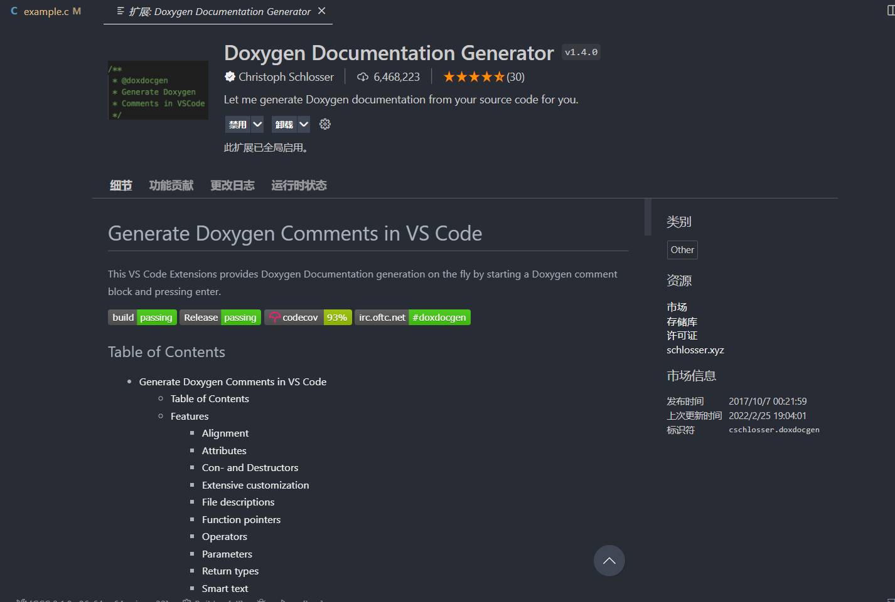
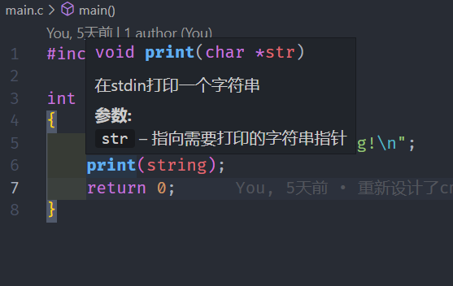
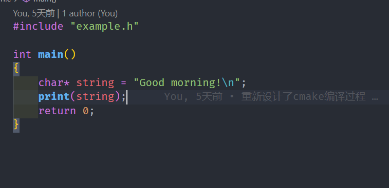

# 代码规范

### 命名规则

#### 变量命名规则

**所有**的局部变量都使用小写的下划线命名法。

```C
int bus_position;
char* output_string
```

在变量命名时应注意尽可能简洁清晰，但在不能为了简洁而导致变量意义的不明。

错误示范：

```C
// DO NOT DO THIS:
lv_indev_drv_t indev_drv;
```

正确示范：

```C
lv_input_device_driver_t mouse_input;
```

> 本例子来自LVGL库。
>
> lv表示这个类型来自LVGL库，input_device表示这个一个输入设备，driver表示这是一个驱动，后缀t表示这是一个类型。

#### 常量命名规则

采用`#define`定义的常量采用全大写下划线命名法

```C
#define MAX_STR_LENGTH 1000
```

#### 函数命名规则

**所有**函数采用驼峰命名法。

```C
int StrLength(char* str);
```

### 代码风格

#### 缩进

统一使用`tab`，四个空格的缩进。

```C
#include <stdio.h>

int main()
{
	printf("缩进是四格。\n");
    return 0;
}
```

> 这点一般不需要注意，现在流行的IDE都是四格缩进。

#### 大括号

所有的大括号都需要提行书写。

```C
if()
{

}
for()
{

}
int main()
{

}
```

同时注意在代码中所有的代码块都需要用大括号包裹，即使是一行的情形。

```c
// DO NOT DO THIS
if(1)
	printf("...");
// DO THIS
if(1)
{
	printf("...");
}
```

### 注释

采用`Doxygen`风格的注释

> 在`VSCode`中安装`Doxygen Documentation Generator`这个扩展。
>
> 
>
> 方便使用下列的功能。

在函数，变量的**上一行**输入`/**`后回车来创建模板。

```C
/**
 * @brief 在stdin打印一个字符串
 * 
 * @param str 指向需要打印的字符串指针
 */
void print(char* str)
{
    printf("%s", str);
}
```

```C
#include "example.h"

int main()
{
    /**
     * @brief 需要输出的字符串
     * 
     */
    char* string = "Good morning!\n";
    print(string);
    return 0;
}
```

在`@brief`的后面输入函数的作用简述，在`@param`的输入每个参数的意义， 在`@return`的后面输入返回值的意义。

在`VSCode`中将指针悬停在函数上时就可以查看这个注释。



其他的注释都应该放在需要注释行的上一行。

> 在`Doxygen`规范中，所有的注释都是注释下一行的代码。

在文件开头的注释**不做要求**，我感觉应该没有什么用。

> 这里推荐一个`VSCode`插件`GitLens`，可以方便的查看提交信息，~~便于在发现问题时锤人~~。
>
> 

### 杂项

- 函数中的局部变量不必在函数的头部统一命名，但是建议比较重要的变量在头部先声明，并且使用注释注明变量的作用
- 循环的变量一般情况下都在`for`语句中声明，不在循环以外的地方使用。但如果较为特殊的地方使用到，请使用注释表明。并且循环变量使用`i`,`j`,`k`。
- `switch`语句中必须要有`default`的部分。
- 每行代码不超过80个字符。