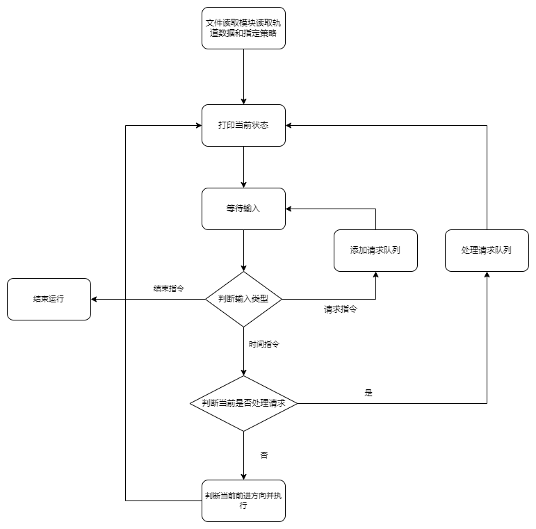

# 概要设计

## main函数流程



## 轨道模块

> 轨道模块是比较基础的模块，许多模块都建立在这个模块的基础上

模块的主体是一个表示每个轨道节点的结构体。

### 创建结构体

```C
/**
 * 创建轨道列表
 * @param length 站点之间的距离
 * @param node_num 站点的个数
 * @return 指向首站的指针
 */
rail_node_t * CreateRails(int length, int node_num);
```

这个函数的难点应该是创建一个双向的循环链表。

### 寻找指定的站点

```C
/**
 * 查找指定编号的站点指针
 * @param rails 轨道的头节点地址
 * @param id 需要查找的站点编号
 * @return 需要查找站点指针
 */
rail_node_t *FindNode(rail_node_t rails, int id);
```

比较重要的工具函数，给定编号寻找对应的站点站点指针，不过没啥难度。

## 公交车模块

> 公交车模块就是比较复杂的模块了。

模块的主体是一个表示公交车的结构体。

### 运行公交车

```C
/**
 * 每个时刻使公交车前进
 * @param rails 轨道链表
 * @param direction 公交车前进的方向
 * @param bus 公交车
 * @return 公交车是否到达站点
 */
int RunBus(rail_node_t* rails, bus_t bus, int direction);
```

这个函数不难，就是根据指定的方向让公交车前进，同时判断公交车是否到站。

## 请求模块

请求模块的核心是一个表示请求的结构体。

### 创建请求

```C
/**
 * 创建请求
 * @param query 请求链表队列
 * @param type 请求的类型
 * @param node 请求产生/指向的站点
 */
void CreateQuery(bus_query_t query, int type, rail_node_t node);
```

还是一个简单的链表创建函数，主要的关键点在于说明的第五点第四条：

> 如果在某个请求没有完成时再有相同的请求(请求类型和站点全部相同)发生，则该请求被抛弃

也就是在创建的时候要判断是否已存在相同的请求。

### 删除请求

> 删除请求其实就是处理请求的同义词

这个函数没啥意思，就是删除一个链表节点。

## 控制器模块

> 全程序最复杂的模块

### 时间计算

一个`int`类型的全局变量储存全局的时间。

```C
/**
 * 时间增加
 */
void AddTime();
```

一个可有可无的函数，负责将时间加一。

> 可能后期删除，作用不明显。

### 策略简述

策略的相关函数会在公交车到站的时候调用。

策略一般包括两个函数，方向控制函数和请求处理函数。

### 先来先服务策略(FCFS)

> first come first serve 
>
> 对于先来先服务策略，车一次停站只完成一个请求，即使在这个站点上即有乘车请求，车内也有到该站的请求，也只能按策略完成已经调度的那个请求。但是完成当前请求后，如果发现时间序列上后续的一个或多个连续请求都恰好在同一站点（即连续的同站点请求位置相同，但请求类型不同），则可以立即完成这些连续的同站点请求，也就是说特殊情况下，一次停车的1秒内可完成多个请求。

#### 方向

```C
/**
 * 在先来先服务策略下应该前进的方向
 * @param bus 公交车
 * @param queries 请求队列链表
 * @return 前进的方向
 */
int FCFSDirection(bus_t bus, bus_query_t queries);
```

直接给出最先的一个请求就可以了。

将给定的请求赋给全局变量。

#### 请求

```C
/**
 * 在先来先服务策略下给出处理的请求
 * @param bus 公交车
 * @param queries 请求队列链表
 * @return 需要处理的请求
 */
bus_query_t FCFSQuery(bus_t bus, bus_query_t queries);
```

按照指定的策略给出现在可以处理的请求。

在这里是当前所在站点和第一个请求指向站点相同是即可处理，而且连续处理。

### 最短寻找时间优先(SSTF)

> 对于最短寻找时间优先策略，一次服务的目标请求一旦确定，即使中途产生更优的请求也不可以更改。但如果新的请求恰好可以顺便服务（同方向的站台请求或车内请求），可以为新的请求停站。具体为：程序计算离当前车的位置最近的请求，如果没有请求则原地不动，否则按最近的路线（顺、逆时针）去接（送）。如果车途中遇到与车目前同方向的上车或下车请求，可以停下一秒解决，反方向的上车请求不停车。车服务完目标后，反复此过程，直到end。特别地，当车到达目标站点时，可以停一次车(1秒钟)完成该站点已接收的所有类型请求(区别于顺便站停靠）。

#### 方向

```C
/**
 * 在最短寻找时间策略下应该前进的方向
 * @param bus 公交车
 * @param queries 请求队列链表
 * @return 前进的方向
 */
int SSTFDirection(bus_t bus, bus_query_t queries);
```

这个函数比较难，求出最短前进的方向即可。

将处理的请求赋给全局变量。

#### 请求

```C
/**
 * 在最短寻找时间策略给出处理的请求
 * @param bus 公交车
 * @param queries 请求队列链表
 * @return 需要处理的请求
 */
bus_query_t SSTFQuery(bus_t bus, bus_query_t queries);
```

给出当前需要处理的请求。注意有些请求时可以处理的，有些请求时不能顺便处理的。

### 顺便服务策略(SCAN)

#### 方向

```C
/**
 * 顺便服务的前进方向
 * @param bus 公交车
 * @param queries 请求队列链表
 * @return 前进的方向
 */
int SCANDirection(bus_t bus, bus_query_t queries);
```

也是判断最短的前进方向，但是

## 输入输出模块

> 输入输出模块是比较基础的模块，主要作用就是调用其他模块实现的功能。

### 配置文件读取

```C
/**
 * 读取配置文件，创建轨道链表，同时读取需要使用的策略
 * @return 指向轨道链表的指针
 */
rail_node_t* ReadConfigFile();
```

这个函数需要完成三个任务：

- 解析配置文件。（重点）
- 调用函数创建轨道列表。
- 读取指定的策略。

### 打印当前状态

```C
/**
 * 打印当前的状态
 * @param rails 轨道链表
 * @return 返回需输出的字符串
 */
char* PrintState();
```

输出的格式如下：

```
TIME:秒数
BUS:
position:0
target: 0000000000
STATION:
clockwise: 0000000000
counterclockwise: 0000000000
```

这个函数的实现应该不难，遍历几个链表就结束了。

> 返回一个字符串是为了便于测试，直接`printf`出来不好测试，也不符合解耦的设计策略。

### 读取输入

```C
/**
 * 读取标准输入流中的输入
 * @param inputString 输入的字符串
 * @return 当前读取的状态
 */
int ReadInput(char* inputString);
```

这个函数的实现比较困难，在于读取对应的输入并调用相关的函数。

输出的`int`值是一系列定义的宏：

```C
#define IO_CLOCK 0 // 读取时钟指令
#define IO_READING 1 // 读取请求指令
#define IO_END 2 // 读取结束指令
```

便于main函数确定下一步的行为。


