# 生产环境

> 遇到任何的问题都可以告诉我！！

## 软件安装

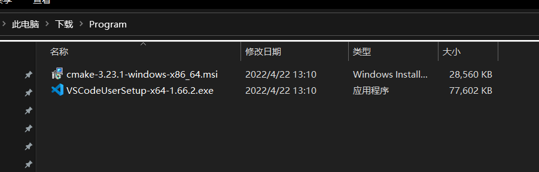

在`Program.zip`压缩包中有两个程序，分别是`cmake`和`VSCode`。

这两个软件的安装都比较的简单。先解压缩文件，分别双击两个安装程序安装就可以了。在安装的过程应该只用无脑下一步。

> 在安装`VSCode`的过程中可能需要选择为”所有用户“还是”当前用户“安装，一般选择当前用户就可以了。

## 编译器的安装

编译器的安装算是比较复杂的。

首先解压缩`mingw64.zip`这个压缩包，然后把这个文件夹放在一个**你自己记得到**而且**文件路径中间没有空格没有中文没有什么奇奇怪怪字符**的地方。

> 这里表示把工具添加进入环境变量，我们就不用再运行程序的时候指定程序所在的位置，系统会根据我们提供的名称在我们指定的路径下去搜索可执行的程序。

然后同时按下`win`和`s`组合键，打开搜索面板，搜索`环境变量`，选择`编辑系统环境变量`

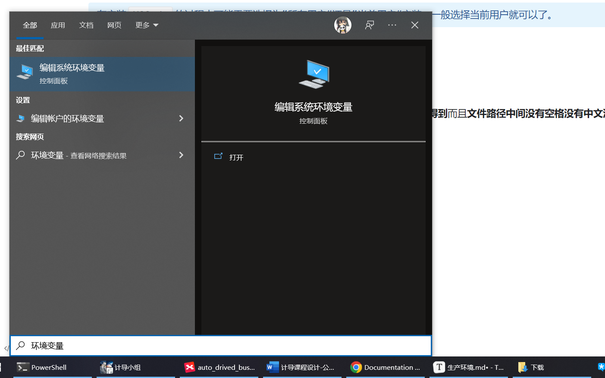

打开这个界面

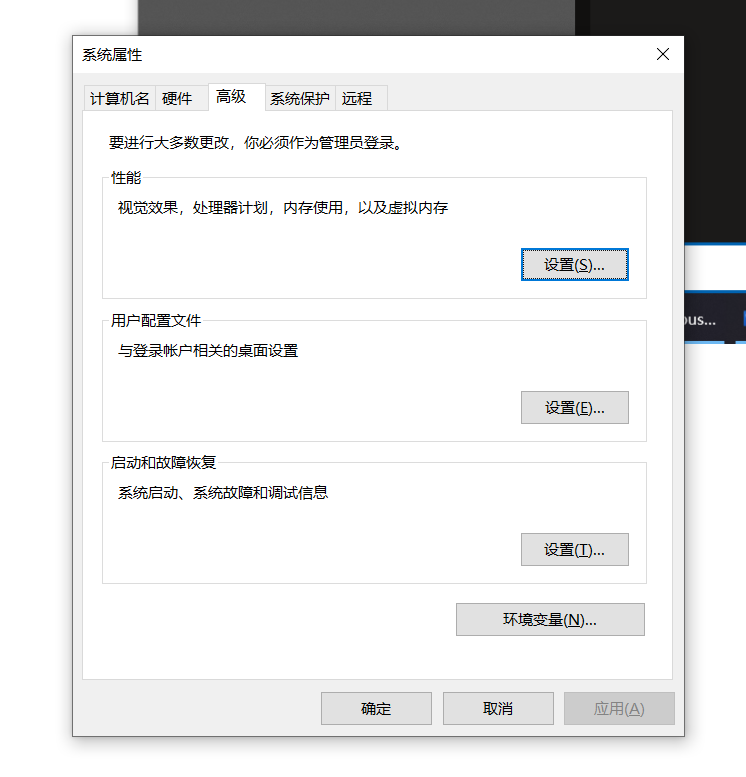

点击右下方的`环境变量...`，打开下面的界面

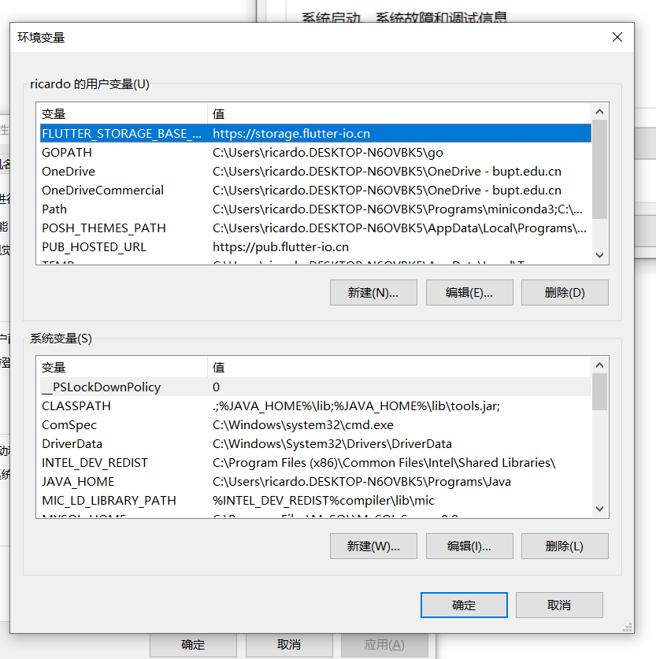

我的界面可能和你们的看起来相当的不一样，尤其是里面的内容。

选中上面那一块区域，也就是“用户变量”中的`path`，就像下图所示

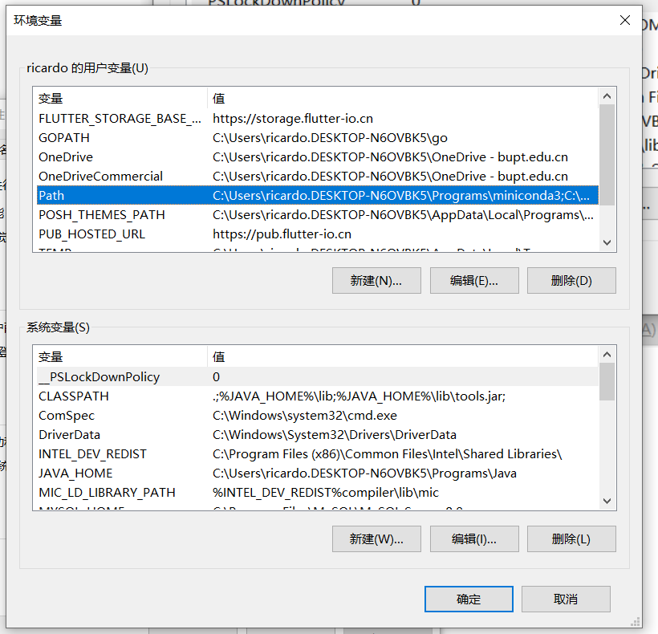

然后点击中间那三个按钮中的“编辑”，打开下一个界面

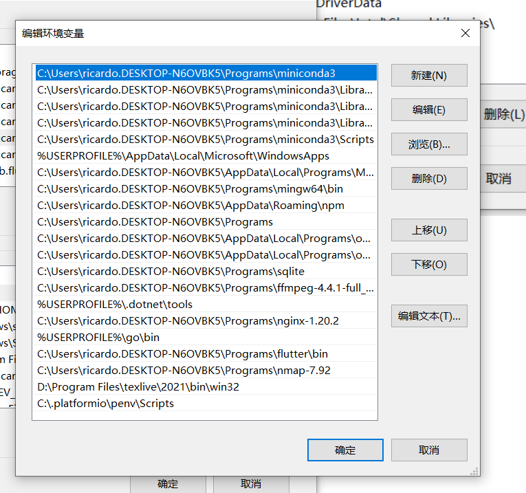

> 可能我们的界面看起来相当的不一样，我设置了相当数量的环境变量，这也侧面说明了设置这个是非常重要的（

点击右侧的“新建”按钮，


然后再点击右边的“浏览”按钮，

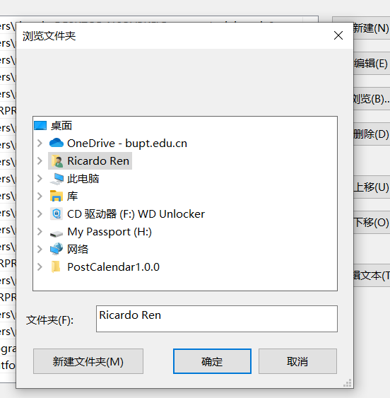

选择到之前解压的编译器路径下，指向`bin`文件夹。

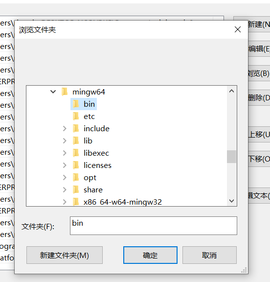

点击确定。

然后再次点击右侧的“新建”-“浏览”，但是这次选择`C:\Program Files\cmake\bin`这个文件夹，然后一路点击确定。

编译器的安装就算是结束了。

## 测试环境的安装

现在将第三个压缩包`auto_drived_bus.zip`解压到你打算写代码的地方，这个地方的路径同样需要具有**没有中文没有空格没有什么奇奇怪怪的字符**的buff。

然后打开`VSCode`,选择打开文件夹，打开刚才解压的那个文件，现在界面应该是这样的。

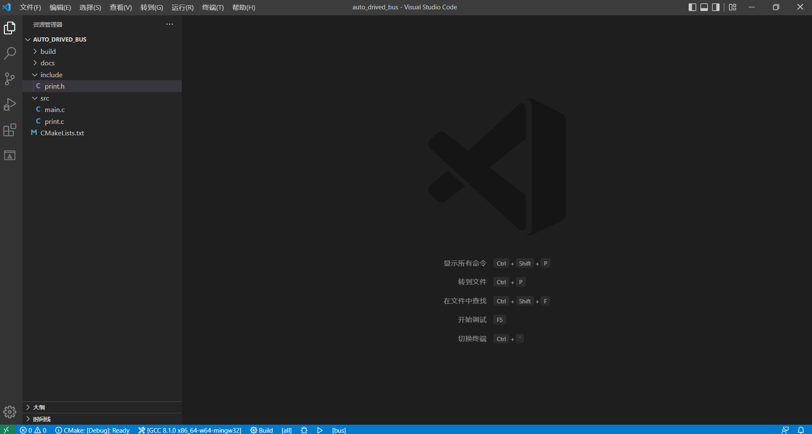

然后按下`ctrl`和`~`组合键，打开终端。

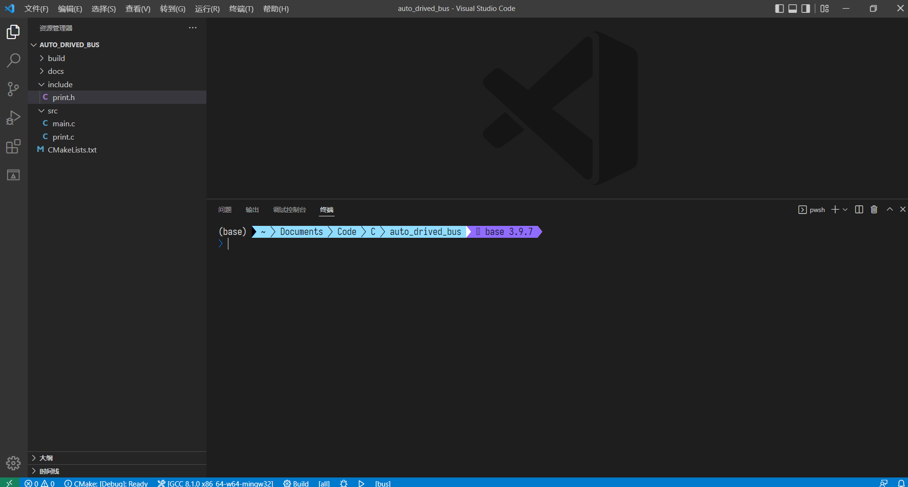

依次输入下列三条命令

```bash
cd build 
```

```bash
cmake .. -G "MinGW Makefiles"
```

```bash
cmake --build .
```

> 在输入的时候不要遗漏了`.`这类符号。

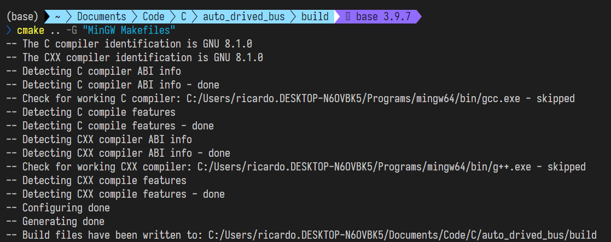

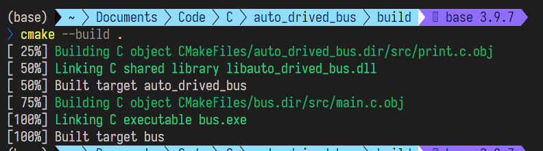

然后输入

```bash
bus.exe
```

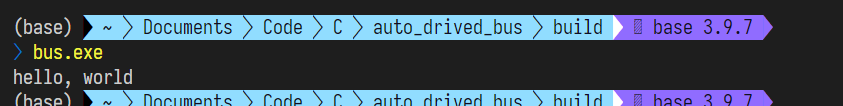

说明everything works well。

## 原理的简单解释

### 多文件编译

在之前的学习中我们接触的都是单文件的编译

```bash
gcc example.c -o example.exe
```

在上面的命令中`gcc`是编译器，`example.c`是源文件，`example.exe`是编译之后生成的可执行文件。

但是如果我们现在是多文件编译呢？我们假设现在有两个文件`lib.c`和`main.c`,`lib.c`是一个库的源文件，里面有一些函数是我们需要的，我们会在`main.c`中调用这些函数。

那现在我们需要解决两个问题：

- `main.c`文件中没有`lib.c`中编写函数的定义
- 如何才能将两个文件编译为一个可以运行的可执行文件

对于第一个问题，我们使用头文件来解决，`lib.h`这个头文件中就包含了在`lib.c`中编写的所有函数的声明，当我们在`main.c`文件中添加

```C
#include "lib.h"
```

之后，我们就可以在`main.c`文件中愉快的使用`lib.c`中的函数了。

对于第二个问题，我们使用一种名叫“链接”的方法解决

```bash
gcc lib.c -o lib.o # 生成lib.c对应的可执行文件
gcc main.c -o main.o # 生成main.c对应的可执行文件
gcc mian.o lib.o -o main.exe # 将两个可执行文件链接在一个生成一个可执行文件
```

> 我们常常使用的`stdio.h`等的头文件对应的可执行文件通过差不多的原理实现的。

然后我们假设一下，如果我们的文件数一多，编译起来要输很多行代码，是不是就很崩溃！

然后我们使用了`cmake`工具。这是一个跨平台的编译工具，~~用过的人都说好~~。

我们只用在`CMakeLists.txt`这个文件中一次写明我们需要使用的文件，就可以一直套用这个模板编译软件。

```bash
cmake .. -G "MinGw Makefiles"
```

这一行的命令表示在我们目前所在的`build`文件夹中生成用于构建程序的一些文件，`..`是一个指针，指向当前文件的上一级目录，也就是`CMakeLists.txt`以及我们程序源代码所在的地方，`-G "MinGw Makefiles"`表示的是生成的文件是我们使用的编译器`mingw64`可以识别的格式。

```bash
cmake --build .
```

这一行是用我们刚刚生成的生成文件调用编译器生成可执行文件，`.`也是一个指针，它指向当前目录。

注意，如果在之后我们没有修改过`CMakeLists.txt`文件，那我们每次修改了源代码之后就只用执行

```bash
cmake --build .
```

来重新生成可执行文件；

如果我们修改了`CMakeLists.txt`文件，我们就需要在执行

```bash
cmake ..
```

来重新生成那个辅助文件。

> 这里我们不用加上 `-G "MinGw Makefiles"` ，编译器只用指定一次。

### 在工程的实际

在初步了解了相关的知识之后，我们就可以开始把他们运用在工程中了。

我们的实际项目结构如下

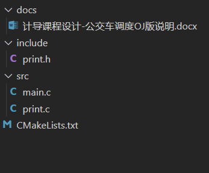

`include`目录下是我们各个模块的头文件，现在的示例是`print`模块的`print.h`,而这个模块的源文件是在`src`目录下的`print.c`文件。

`src`目录下就是我们当前各个模块和主程序的源代码文件。

> CMakeLists.txt由我编写，我会写上比较详尽的注释，你们可以观摩。

那我们第一阶段的架构设计实际上就是头文件的编写。为啥？头文件包括我们各个模块中需要使用的函数的定义，在项目中会使用到的结构体、自行定义的类型等的都会写在我们的头文件里面，实际上，编写头文件的过程就是架构设计的过程。

在编写完成我们的头文件之后，我们只需在对应的源文件中实现相关的函数，我们的开发就算是完成了。

## VSCode的配置

### 安装扩展

为了能在`VSCode`中流畅的写`C\C++`,我们需要在`VSCode`中安装几个插件。

在`VSCode`的主界面上选择“插件”图标，也就是右侧的最后一个

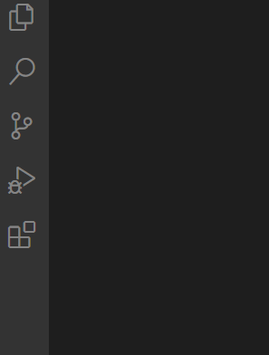

> 图中的最下面那个图标

打开这个界面

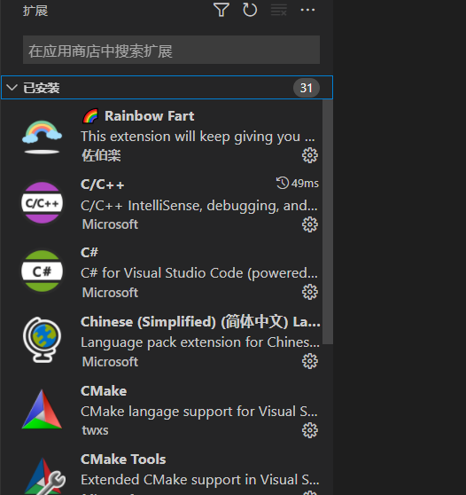

在搜索栏中只用数一个字母`C`，

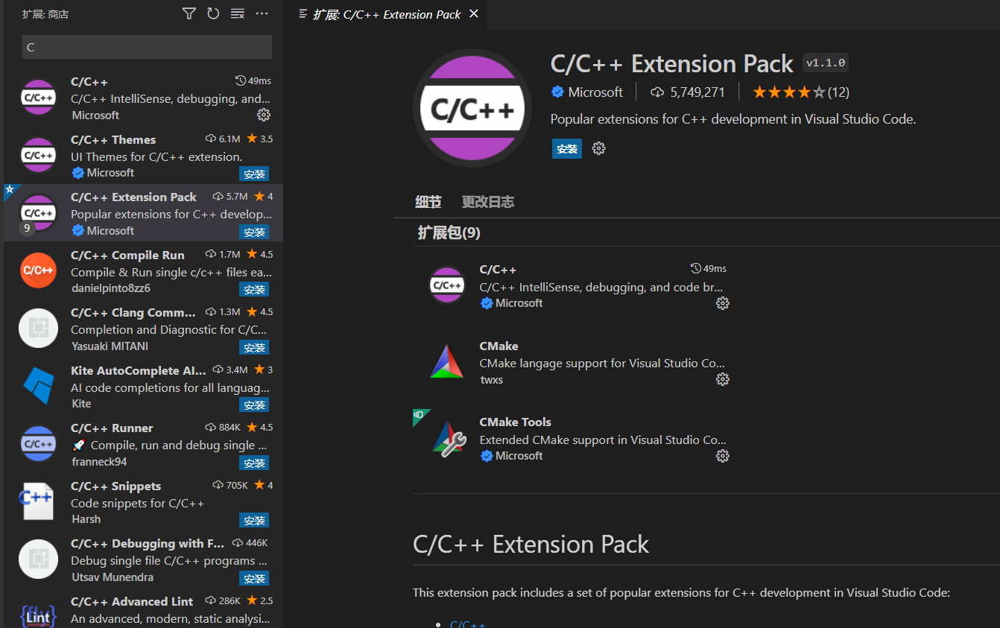

选择这个`C/C++ Extension Pack`，这是一个辅助`C/C++`编写的扩展的合集，只用安装这个扩展我们就可以愉快~~并不~~的在`VSCode`中写代码了。

> 如果对`VSCode`的全英文界面感到不适，也可以搜索`Chinese`,安装简体中文的扩展包。

### 加载CMake项目

在`VSCode`中也有扩展提供了对于`Cmake`的支持，让我们可以不用在一次次的输入命令来编译。

在安装完扩展之后，我们重新启动`VSCode`，再次打开我们的工程文件夹，这个时候左下角应该会弹出来一个气泡，

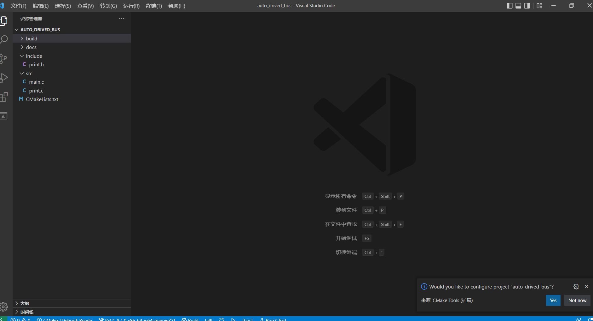

这个气泡就是`cmake`插件在询问你是否设置这个名为`auto_drived_bus`的工程，我们选择"Yes"， 这时`cmake`扩展就会使用系统中安装的`cmake`来设置我们的项目。

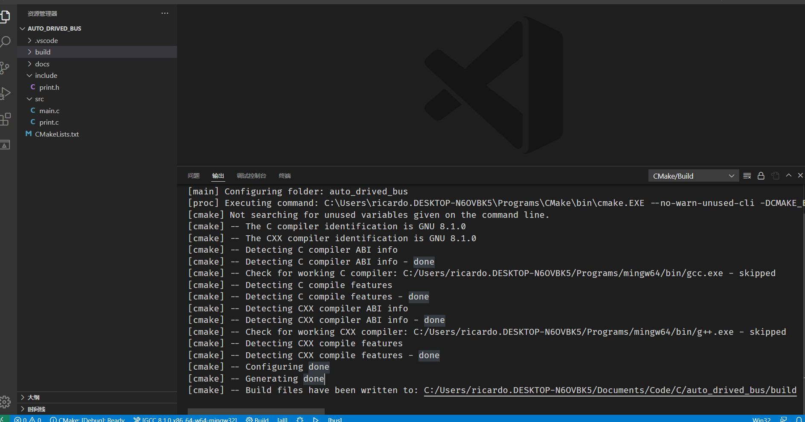

这时在我们`VSCode`底部的状态栏就会出现一些`cmake`的选项，我们逐个来看

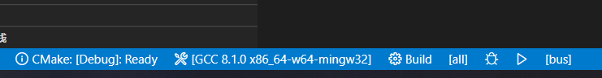

第一个表示`cmake`目前使用的是`debug`模式，我们可以点击切换不同的生成模式

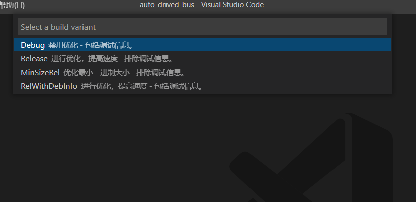

第二个表示我们当前使用的编译器，如果我们在电脑上安装了不同的编译器，例如微软的`msvc`就可以在点击切换，当然，这里切换不仅是编译器的选项，生成的编译文件也从`makefile`变成了`vcporj`。

第三个按钮`build`是编译按钮，点击这个按钮就会生成可执行文件。

第四个按钮`all`是选择生成的对象，在一般情况下不用改动。

> 在这里我们的生成对象主要有两个，一个是我们的库，另一个是我们的主程序。

第五六个是两个按钮，长得像虫一样的那个表示调试按钮，说明这是用来抓`bug`的，下一个的那个就是一个简单的运行按钮，点一下就会自动开始编译运行。

> 我们也可以使用一些快捷键来代替上面的一些东西，比如`F5`表示运行，`ctrl`和`F5`同时按表示运行，按`F7`表示编译。

> 我这边的建议是使用`F7`编译之后，再在终端中执行，这样和OJ上的执行比较的近似。

## 下一步...

### 关于Git

再实际使用Git之前，先推荐这篇MIT的英文教程[VERSION CONTROL](https://missing.csail.mit.edu/2020/version-control/)，这边文章没有像一般的Git教程一样扔给你一大堆的命令，而是介绍了Git的原理，我觉得这样可能更加易懂。

> 如果看英文有困难，可以看这个[翻译版](https://missing-semester-cn.github.io/2020/version-control/)

如果黄海还不发`Gitlab`的文档的话，我就会打算在`gitee`上建立仓库开始干活了，我们在实践中学习`git`。

> 高情商：在实践中学习
>
> 低情商：你们自己摸索

### 关于typora

用`markdown`撰写文档是我一直的习惯，用word写东西实在不是碳基生物能干的活。不过由于我们需要叫word格式的文档，我结合`markdown`转`word`的效果和大家的意见在做决定。

> 最后再次强调，有什么问题一定要问！！

## 写在最后

你们可能嫌我为啥要搞这么麻烦，为啥不直接简简单单的一个文件和`Dev C++`开发了事。

我当时想的是既然这是一次“大作业”，而且黄海也反复强调“软件工程”，那我们不如好好的体验一下“现代”的`C/C++`开发是什么样子的。

我最开始的想法仅仅是统一用`VSCode`进行开发，但是使用`VSCode`进行开发涉及到一个比较麻烦的环境配置问题。为了确保只用配置一次环境之后就可以在不同的电脑上获得流畅的编码体验，我就使用现在流行的`Cmake`工具进行统一的环境配置。

使用这个工具的好处有以下几点：

- 不必关心比较复杂的`VSCode`设置
- 可以进行比较舒适的模块化开发，避免的繁琐的编译
- 便于后期引入图形库进行图形界面的开发
- `CMake`是现在`C/C++`项目开发的事实标准。